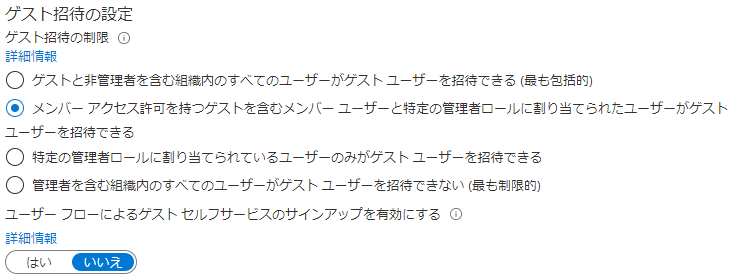

---
lab:
    title: '08 - 外部コラボレーションの設定を構成する'
    learning path: '01'
    module: 'モジュール 03 - 外部 ID の実装と管理を行う'
---

# ラボ 08: 外部コラボレーションの設定を構成する

## ラボ シナリオ

承認されたゲストがアクセスするには、組織の外部コラボレーション設定を有効にする必要があります。

#### 推定時間: 5 分

## 演習 1 - ゲスト ユーザーを組織に招待できるようにする

### タスク 1 - 外部コラボレーションの設定を構成する

1. [https://portal.azure.com](https://portal.azure.com) にテナント管理者としてサインインします。
2. **「Azure Active Directory」** を選択します。
3. **「External Identities > 外部コラボレーション設定」** を選択します。
4. 画面の上部に表示される **「電子メールのワンタイム パスコード」** 通知リンクをクリックします。

    **注** - ワンタイム パスコードは、ユーザーを組織に招待するための非常に安全な方法です。

5. `Home > Contoso Marketing >` **「外部 ID」** をクリックして、前の画面に戻ります。 
6. 

4. **「ゲスト ユーザー アクセス」** で、使用可能なアクセス レベルを確認し、**「ゲスト ユーザーのアクセスを、自分のディレクトリ オブジェクトのプロパティとメンバーシップに制限する (最も厳しい制限)」** を選択します。

    **メモ**

    - ゲスト ユーザーにメンバーと同じアクセス権を付与する (最も包括的): このオプションを選択すると、ゲストがメンバー ユーザーと同じように Azure AD リソースとディレクトリ データにアクセスできるようになります。
    - ゲスト ユーザーに対してディレクトリ オブジェクトのプロパティとメンバーシップへのアクセスを制限する: (デフォルト) この設定を選択すると、ゲストは、特定のディレクトリ タスク (ユーザー、グループ、またはその他のディレクトリ リソースを列挙するなど) を実行できなくなります。ゲストは、非表示でないすべてのグループのメンバーシップを表示できます。
    - ゲスト ユーザーのアクセスを、自分のディレクトリ オブジェクトのプロパティとメンバーシップに制限する (最も厳しい制限): この設定では、ゲストは自分のプロファイルのみにアクセスできます。ゲストは、他のユーザーのプロファイル、グループ、またはグループ メンバーシップを参照することはできません。

    

5. **「ゲストの招待設定」** で、**メンバー ユーザーと特定の管理者のロールに割り当てられたユーザーは、メンバーの権限を持つゲストを含むゲストユーザーを招待できる**を選択します!

    **メモ**
    
    - 管理者とゲスト招待元ロールのユーザーは招待ができる: 管理者と "ゲスト招待元" ロールのユーザーがゲストを招待できるようにするには、このポリシーを「はい」に設定します。
    - メンバーは招待ができる: ディレクトリ内の管理者以外のメンバーがゲストを招待できるようにするには、このポリシーを「はい」に設定します。
    - ゲストは招待ができるゲストが他のゲストを招待できるようにするには、このポリシーを「はい」に設定します。
    - ユーザー フローによるゲストのセルフサービス サインアップを有効にする: ディレクトリ内のアプリケーションに関連付けられているユーザー フローを介してゲストのセルフサービス サインアップを有効または無効にします。無効にした場合、ゲストはディレクトリに招待される必要があります。
    - 「メンバーは招待ができる」が「いいえ」に設定され、「管理者とゲスト招待元ロールのユーザーは招待ができる」が「はい」に設定されている場合、ゲスト招待元ロールのユーザーは引き続きゲストを招待できます。

    

6. **「コラボレーションの制限」** で、使用可能なオプションを確認し、既定の設定をそのまま使用します。

    **重要**
    
    - 許可リストまたは拒否リストのいずれかを作成できます。両方の種類のリストを設定することはできません。既定では、許可リストに含まれないドメインはすべて拒否リストに含まれます。また、その逆も言えます。
    - 各組織に作成できるポリシーは 1 つだけです。ポリシーを更新してより多くのドメインを含めることも、ポリシーを削除して新規に作成することもできます。
    - 許可リストまたは拒否リストに追加できるドメインの数は、ポリシーのサイズによってのみ制限されます。ポリシー全体の最大サイズは 25 KB (25,000 文字) です。これには、許可リストまたは拒否リストと、他の機能向けに構成された他のパラメーターが含まれます。
    - このリストは、OneDrive for Business や SharePoint Online の許可/ブロック リストとは無関係に機能します。SharePoint Online で個々のファイルの共有を制限する場合は、OneDrive for Business および SharePoint Online の許可リストまたは拒否リストを設定する必要があります。
    - このリストは、招待を既に使用した外部ユーザーには適用されません。リストは、リストの設定後に適用されます。ユーザーの招待が保留中の状態にあり、ドメインをブロックするポリシーを設定した場合、ユーザーが招待の使用を試みると失敗します。

7. 完了したら、変更を保存します。
