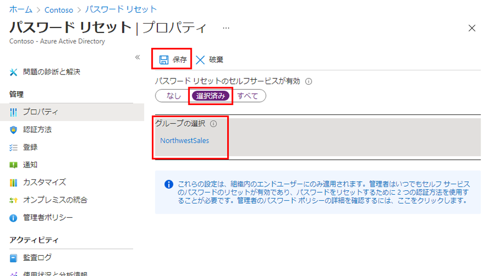
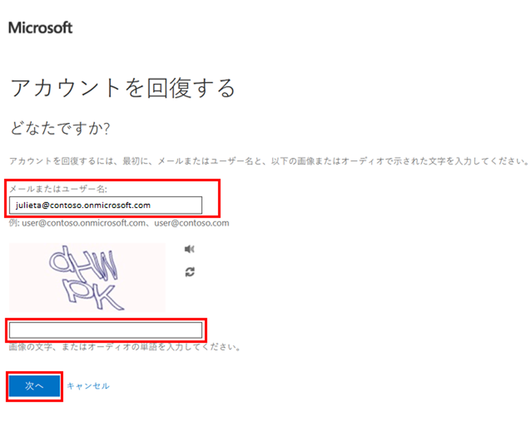
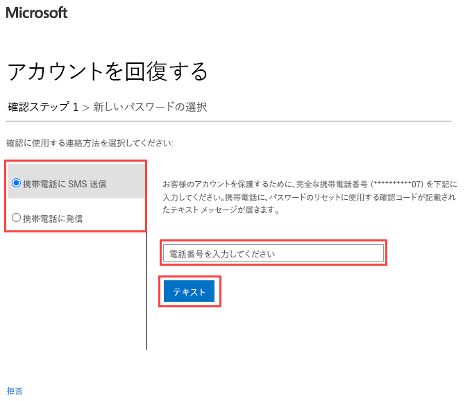

---
lab:
    title: '13 - Azure AD のパスワード リセットのセルフサービスを有効にする'
    learning path: '02'
    module: 'モジュール 02 - ユーザー認証を管理する'
---

# ラボ 13 - セルフサービス パスワード リセットを構成してデプロイする
## ラボ シナリオ

会社は従業員に権限を与え、セルフサービスによるパスワードのリセットを可能にすることを決定しました。組織内でこの設定を構成する必要があります。

#### 推定時間: 15 分

## 演習 1 - SSPR を有効にしてグループを作成し、それにユーザーを追加する

### タスク 1 - SSPR を割り当てるグループを作成する

最初に SSPR を限定的なユーザー セットにロールアウトして、SSPR の構成が期待どおりに動作することを確認します。限定されたロールアウト用のセキュリティ グループを作成し、グループにユーザーを追加してみましょう。

1. Azure Active Directory ブレードの「**管理**」で、「**グループ**」を選択し、右側のウィンドウで「**+ 新しいグループ**」を選択します。

2. 次の情報を使用して、新しいグループを作成します。

    | **設定**| **値**|
    | :--- | :--- |
    | グループの種類| セキュリティ|
    | グループ名| SSPRTesters|
    | グループの説明| SSPR のロールアウトのテスター|
    | メンバーシップの種類| 割り当て済み|
    | メンバー| Alex Wilber |
    | |  Allan Deyoung |
    | | Bianca Pisani |
  
    
3. 「**作成**」を選択します。

    

### タスク 2 - テスト グループの SSPR を有効にする

グループで SSPR を有効にします。

1. 「Azure Active Directory」ブレードに戻ります。

2. 「**管理**」で「**パスワード リセット**」を選択します。

3. 「パスワード リセット」ブレードの「プロパティ」ページの「**セルフサービスによるパスワードのリセット**」で、「**選択済み**」を選択します。

4. 「**グループの選択**」を選択します。

5. 「既定のパスワード リセット ポリシー」ウィンドウで、**SSPRTesters** グループを選択します。

6. 「パスワード リセット」ブレードの「プロパティ」ページで、「**保存**」を選択します。

    

7. 「**管理**」で、「**認証方法**」、「**登録**」、「**通知**」、「**カスタマイズ**」の各設定の既定値を選択して確認します。

    **注**: このラボの残りの部分では、認証方法の 1 つとして**電話**を選択することが重要ですが、他のオプションも使用できます。

### タスク 3 - Alex に SSPR に登録する

SSPR の構成が完了したので、作成したユーザーの携帯電話番号を登録します。

1. 別のブラウザーを開くか、InPrivate または Incognito ブラウザー セッションを開いて、[https://aka.ms/ssprsetup](https://aka.ms/ssprsetup) に移動します。

    これは、ユーザー認証を求めるメッセージが表示されるようにするためです。

2. パスワードを使って、**AlexW@** `<<organization-domain-name>>.onmicrosoft.com` としてサインインする = テナントの管理者パスワードを入力してください (管理者パスワードを取得するには、「ラボ リソース」タブを参照してください)。

    **注** - organization-domain-name は実際のドメイン名に置き換えます。

3. パスワードを更新するように求められたら、任意の新しいパスワードを入力します。新しいパスワードを必ず記録しておいてください。

4. 「**詳細情報が必要**」ダイアログ ボックスで、「**次へ**」を選択します。

5. 「アカウントのセキュリティ保護」ページで、「**電話**」オプションを使用します。

    

    **注** - このラボでは、「**電話**」オプションを使用します。携帯電話の詳細を入力します。

6. 電話番号フィールドに個人の携帯電話番号を入力します。
7. 「**コードを SMS 送信する**」を選択します。
8. 「**次へ**」を選択します。

9. 携帯電話でコードを受け取ったら、テキスト ボックスにコードを入力し、「**次へ**」を選択します。

10. 電話が登録されたら、「**次へ**」を選択し、「**完了**」を選択します。

11. ブラウザーを閉じます。サインイン プロセスを完了する必要はありません。

### タスク 4 - SSPR をテストする

次に、ユーザーが自分のパスワードをリセットできるかどうかをテストしてみましょう。

1. 別のブラウザーを開くか、InPrivate または Incognito ブラウザー セッションを開いて、[https://portal.azure.com](https://portal.azure.com) に移動します。

    これは、ユーザー認証を求めるメッセージが表示されるようにするためです。

2. **AlexW@** `<<organization-domain-name>>.onmicrosoft.com` を入力してから、「**次へ**」を選択します。

    **注** - organization-domain-name は実際のドメイン名に置き換えます。

3. 「パスワードの入力」 ページで、「**パスワードを忘れた場合**」を選択します。

4. 「アカウントの復元」ページで、要求された情報を入力し、「**次へ**」を選択します。

    

5. 「**確認ステップ 1**」タスクで、「**携帯電話に SMS 送信**」を選択し、電話番号を入力して、「**テキスト**」を選択します。

    

6. 確認コードを入力し、「**次へ**」を選択します。

7. 「新しいパスワードの選択」ステップで、新しいパスワードを入力して確認します。  パスワード = **Pass@w.rd1234** を推奨します。

8. 完了したら、「**完了**」を選択します。

9. 作成した新しいパスワードを使用し、**AlexW**としてサインインします。

10. 確認コードを入力し、サインイン プロセスを完了できることを確認します。

11. 完了したら、ブラウザーを閉じます。

### タスク 5 - SSPRTesters グループに属していないユーザーを試してみるとどうなるか?

1. テストとして、新しい InPrivate ブラウザー ウィンドウを開き、GradyA として Azure portal にログインして、「**パスワードを忘れた場合**」オプションを選択します。
