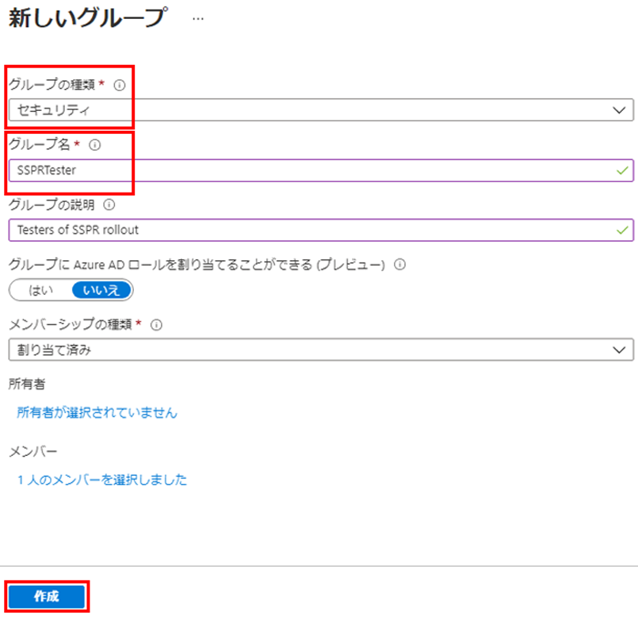
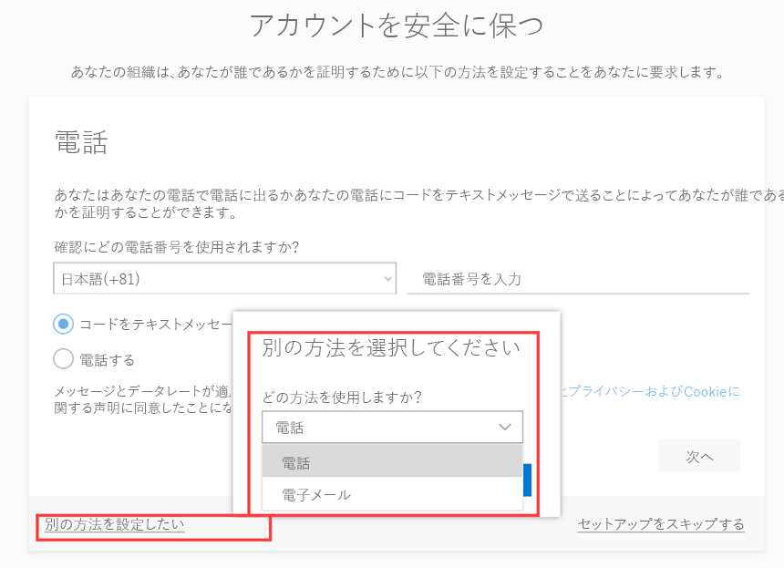

---
lab:
    title: '13 - Azure AD の Multi-Factor Authentication を有効にする'
    learning path: '02'
    module: 'モジュール 02 - ユーザー認証を管理する'
---

# ラボ 13 - セルフサービス パスワード リセットを構成してデプロイする

## ラボ シナリオ

会社は従業員に権限を与え、セルフサービスによるパスワードのリセットを可能にすることを決定しました。組織内でこの設定を構成する必要があります。

#### 推定時間: 15 分

## 新しいユーザーを追加する

1. グローバル管理者アカウントを使用して、[https://portal.azure.com](https://portal.azure.com) にサインインします。

1. ポータル メニューを開き、**「Azure Active Directory」** を選択します。

1. 作成した Azure AD 組織の **「管理」** で、**「ユーザー」** > **「新しいユーザー」** を選択します。

1. これで「ユーザー」ウィンドウが表示されます。次の値を入力します。

- **ユーザー名**: Utu

- **名前**: Utu Linna

1. **「パスワードの表示」** を選択し、それを後で参照できる場所にコピーします。

1. **「作成」** を選択します。

## グループを作成する

最初に SSPR を限定的なユーザー セットにロールアウトして、SSPR の構成が期待どおりに動作することを確認します。限定されたロールアウト用のセキュリティ グループを作成し、グループにユーザーを追加してみましょう。

1. 「Azure Active Directory」 ブレードで、**「管理」** の下にある **「+ 新しいグループ」** を選択します。

1. 次の情報を使用して、新しいグループを作成します。

    | **設定**| **値**|
    | :--- | :--- |
    | グループの種類| セキュリティ|
    | グループ名| SSPRTesters|
    | グループの説明| SSPR のロールアウトのテスター|
    | メンバーシップの種類| 割り当て済み|
    | メンバー| Utu Linna|
    
1. **「作成」** を選択します。

    

## SSPR を有効にする

グループで SSPR を有効にします。

1. 「Azure Active Directory」ブレードに戻ります。

1. **「管理」** で **「パスワード リセット」** を選択します。

    >注
    >「パスワード リセット」ページに「無料の Premium 評価版を入手して、この機能を使用します」というメッセージがまだ表示される場合は、数分待ってからページを更新します。
    >「パスワード リセット」ブレードの「プロパティ」ページの **「セルフサービスによるパスワードのリセット」** で、**「選択済み」** を選択します。

1. **「グループの選択」** を選択します。

1. 「既定のパスワード リセット ポリシー」ウィンドウで、**SSPRTesters** グループを選択します。

1. 「パスワード リセット」ブレードの「プロパティ」ページで、**「保存」** を選択します。

    

1. **「管理」** で、**「認証方法」**、**「登録」**、**「通知」**、**「カスタマイズ」** の各設定の既定値を選択して確認します。

## SSPR に登録する

SSPR の構成が完了したので、作成したユーザーの携帯電話番号を登録します。

1. 別のブラウザーを開くか、InPrivate または Incognito ブラウザー セッションを開いて、[https://aka.ms/ssprsetup](https://aka.ms/ssprsetup) に移動します。

    これは、ユーザー認証を求めるメッセージが表示されるようにするためです。

1. 前に記録したパスワードを使用し、**uta@***organization-domain-name***.onmicrosoft.com** としてサインインします。

1. organization-domain-name は実際のドメイン名に置き換えます。

1. パスワードを更新するように求められたら、任意の新しいパスワードを入力します。新しいパスワードを必ず記録しておいてください。

1. **「詳細情報が必要」** ダイアログ ボックスで、**「次へ」** を選択します。

1. 「Keep your account secure」 (アカウントのセキュリティ保護) ページで、**「電話」** オプションを使用するか、**「I want to set up a different method」** (別の方法を設定します) リンクを選択します。

    

1. この例では、**「電話」** オプションを使用します。携帯電話の詳細を入力します。

1. **「Text me a code」** (コードを SMS 送信する) を選択します。

1. 携帯電話でコードを受け取ったら、テキスト ボックスにコードを入力し、**「次へ」** を選択します。

1. 電話が登録されたら、**「次へ」** を選択し、**「完了」** を選択します。

1. ブラウザーを閉じます。サインイン プロセスを完了する必要はありません。

## SSPR をテストする

次に、ユーザーが自分のパスワードをリセットできるかどうかをテストしてみましょう。

1. 別のブラウザーを開くか、InPrivate または Incognito ブラウザー セッションを開いて、[https://aka.ms/ssprsetup](https://aka.ms/ssprsetup) に移動します。

    これは、ユーザー認証を求めるメッセージが表示されるようにするためです。

1. 「**メール**、**電話**、**または Skype**」 ボックスに 「**uta@***organization-domain-name***.onmicrosoft.com**」 と入力し、**「次へ」** を選択します。

1. organization-domain-name は実際のドメイン名に置き換えます。

1. 「パスワードの入力」 ページで、**「パスワードを忘れた場合」** を選択します。

1. 「アカウントの復元」ページで、要求された情報を入力し、**「次へ」** を選択します。

    

1. **「確認ステップ 1」** タスクで、**「携帯電話に SMS 送信」** または **「携帯電話に発信」** を選択し、電話番号を入力して、**「テキスト」** を選択します。

    

1. 確認コードを入力し、**「次へ」** を選択します。

1. 「新しいパスワードの選択」ステップで、新しいパスワードを入力して確認します。

1. 完了したら、**「完了」** を選択します。

1. 作成した新しいパスワードを使用し、**Utu** としてサインインします。

1. 確認コードを入力し、サインイン プロセスを完了できることを確認します。

1. 完了したら、ブラウザーを閉じます。
