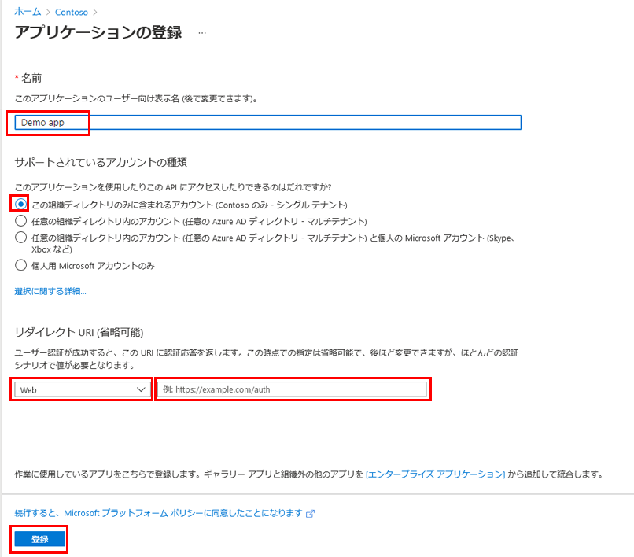
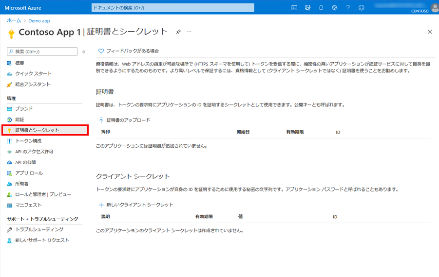

---
lab:
    title: '22 - アプリケーションを登録する'
    learning path: '03'
    module: 'モジュール 03 - アプリの登録を実装する'
---

# ラボ 22 - アプリケーションを登録する

#### 推定時間: 20 分

## アプリケーションを登録する

アプリケーションを登録すると、アプリケーションと Microsoft ID プラットフォームとの間の信頼関係が確立されます。この信頼関係は一方向です。つまり、アプリは Microsoft ID プラットフォームを信頼しますが、その逆はありません。

1. グローバル管理者アカウントを使用して、[https://portal.azure.com](https://portal.azure.com) にサインインします。

2. ポータル メニューを開き、「**Azure Active Directory**」を選択します。

3. 「**Azure Active Directory**」ブレードの「**管理**」の下にある「**アプリの登録**」を選択します。

4. 「**アプリの登録**」ページで、「**+ 新規登録**」を選択します。

5. 「**アプリケーションの登録**」ブレードで既定値を使用して、**デモ アプリ**という名前のアプリを登録します。リダイレクト URI を入力する必要はありません。

    

6. 完了すると、「**デモ アプリ**」ブレードが表示されます。

## リダイレクト URI を追加する

リダイレクト URI は、認証後に Microsoft ID プラットフォームによってユーザーのクライアントがリダイレクトされ、セキュリティ トークンが送信される場所です。たとえば、運用 Web アプリケーションでは、多くの場合、リダイレクト URI は、アプリが実行されているパブリック エンドポイントです。開発時には、アプリをローカルで実行するエンドポイントも追加するのが一般的です。

1. そのプラットフォーム設定を構成して、登録済みのアプリケーションのリダイレクト URI を追加および変更します。

## プラットフォーム設定を構成する

リダイレクト URI など、アプリケーションの種類ごとの設定は、Azure portal の「**プラットフォーム構成**」で構成します。**Web** や**シングルページ アプリケーション**などの一部のプラットフォームでは、リダイレクト URI を手動で指定する必要があります。モバイルやデスクトップなどの他のプラットフォームでは、他の設定を構成するときに自動的に生成されるリダイレクト URI から選択できます。

ターゲットのプラットフォームまたはデバイスに基づいてアプリケーション設定を構成するには、次の手順を行います。

1. Azure portal の「**アプリの登録**」でアプリケーションを選択します。

2. 「**管理**」で、「**認証**」を選択します。

3. 「**プラットフォーム構成**」で「**+ プラットフォームを追加**」を選択します。

4. 「**プラットフォームの構成**」で、アプリケーションの種類 (プラットフォーム) のタイルを選択して、その設定を構成します。

    

    | PaaS (Platform| 構成設定|
    | :--- | :--- |
    | Web| アプリの「**リダイレクト URI**」 (認証後に Microsoft ID プラットフォームによってユーザーのクライアントがリダイレクトされ、セキュリティ トークンが送信される場所) を入力します。サーバーで実行される標準の Web アプリケーションについては、このプラットフォームを選択します。|
    | シングルページ アプリ| アプリの「**リダイレクト URI**」 (認証後に Microsoft ID プラットフォームによってユーザーのクライアントがリダイレクトされ、セキュリティ トークンが送信される場所) を入力します。JavaScript、または Angular、Vue.js、React.js、Blazor WebAssembly などのフレームワークでクライアント側の Web アプリをビルドしている場合は、このプラットフォームを選択します。|
    | iOS/macOS| アプリの「**バンドル ID**」を入力します。これは、*Info.plist* の XCode または「ビルド設定」で見つけることができます。バンドル ID を指定すると、リダイレクト URI が自動的に生成されます。|
    | Android| AndroidManifest.xml ファイルにあるアプリの**パッケージ名**を入力し、**署名ハッシュ**を生成して入力します。これらの設定を指定すると、リダイレクト URI が生成されます。|
    | モバイル アプリケーションとデスクトップ アプリケーション| 「**Suggested redirect URIs**」 (推奨されるリダイレクト URI) の 1 つを選択するか、「**カスタム リダイレクト URI**」を指定します。デスクトップ アプリケーションの場合は、[https://login.microsoftonline.com/common/oauth2/nativeclient](https://login.microsoftonline.com/common/oauth2/nativeclient) をお勧めします。最新の Microsoft Authentication Library (MSAL) を使用していない、またはブローカーを使用していないモバイル アプリケーションには、このプラットフォームを選択します。また、デスクトップ アプリケーションにも、このプラットフォームを選択します。|

5. 「**構成**」を選択して、プラットフォームの構成を完了します。

## 資格情報を追加する

資格情報は、Web API にアクセスする Confidential クライアント アプリケーションによって使用されます。Confidential クライアントの例として、Web アプリ、その他の Web API、またはサービス型およびデーモン型アプリケーションなどがあります。資格情報により、アプリケーションはそれ自体として認証され、実行時にユーザーによる操作は必要ありません。

証明書とクライアント シークレット (文字列) の両方を資格情報として Confidential クライアント アプリの登録に追加できます。

## 証明書を追加する

証明書は、*公開キー*とも呼ばれ、クライアント シークレットよりも高いレベルの保証を提供するため、推奨される資格情報の種類です。信頼された公開証明書を使用する場合は、証明書とシークレット機能を使用して証明書を追加できます。証明書は、次のいずれかのファイル形式である必要があります。.cer、.pem、.crt.

## クライアント シークレットを追加する

クライアント シークレットは、*アプリケーション パスワード*とも呼ばれ、アプリで自身を識別するために証明書の代わりに使用できる文字列値です。2 種類の資格情報のうち、使いやすい方です。多くの場合は開発時に使用されますが、証明書より安全性が低いと見なされています。運用環境で実行するアプリケーションでは、証明書を使用する必要があります。

1. Azure portal の「**アプリの登録**」でアプリケーションを選択します。

2. 「**証明書およびシークレット**」 > 「**+ 新しいクライアント シークレット**」の順に選択します。

3. クライアント シークレットの説明を追加します。

4. 期間を選択します。

5. 「**追加**」を選択します。

6. クライアント アプリケーション コードで使用する**シークレットの値を記録します**。「証明書とシークレット」ページに、新しいシークレット値が表示されます。この値は 1 回しか表示されないため、この値をコピーすることが重要です。ページを更新して戻ってきた場合、マスクされた値としてのみ表示されます。

## Web API を登録する

Web API 内のリソースへのスコープ付きアクセス権を付与するには、まず API を Microsoft ID プラットフォームに登録する必要があります。

1. 上記の手順を実行します。

2. 「**リダイレクト URI の追加**」と「**プラットフォーム設定の構成**」に関するセクションはスキップします。ユーザーは対話的にログインしないため、Web API のリダイレクト URI を構成する必要はありません。

3. ここでは、「**資格情報の追加**」セクションをスキップします。API からダウンストリームにアクセスする場合にのみ、独自の資格情報が必要になりますが、この記事では取り上げません。

Web API を登録すると、スコープを追加する準備は完了です。これを API のコードに使って、API のコンシューマーにきめ細かなアクセス許可を付与することができます。

## スコープを追加する

クライアント アプリケーションのコードによって、保護されたリソース (Web API) への要求と共にアクセス トークンを渡すことにより、Web API で定義された操作を実行するアクセス許可が要求されます。Web API では、操作に必要なスコープ (アプリケーションのアクセス許可とも呼ばれます) が受け取ったアクセス トークンに含まれている場合にのみ、要求された操作が実行されます。

まず、次の手順で Employees.Read.All という名前のスコープの例を作成します。

1. Azure portal にサインインします。

2. 複数のテナントにアクセスできる場合は、上部のメニューの「**Directory + Subscription**」フィルターを使用して、クライアント アプリの登録を含むテナントを選択します。

3. 「**Azure Active Directory**」 > 「**アプリの登録**」を選択し、API のアプリの登録を選択します。

4. 「**API の公開**」 > 「**+ スコープの追加**」を選択します。

    

5. まだ構成していない場合は、「**アプリケーション ID URI**」を設定するように求められます。アプリ ID URI は、API のコードで参照するスコープのプレフィックスとして機能し、グローバルに一意である必要があります。指定されている既定値 (api://<application-client-id> 形式) を使用するか、`https://contoso.com/api` のようにより読みやすい URI を指定できます。

6. 次に、「**スコープの追加**」ウィンドウでスコープの属性を指定します。このチュートリアルでは、例の値を使用するか、独自の値を指定できます。

    | フィールド| 説明| 例|
    | :--- | :--- | :--- |
    | スコープ名| スコープの名前。一般的なスコープの名前付け規則は、resource.operation.constraint です。| Employees.Read.All|
    | 同意できるユーザー| このスコープにユーザーが同意できるかどうかと、管理者の同意が必要かどうか。より高い特権のアクセス許可にするには、「管理者のみ」を選択します。| 管理者とユーザー|
    | 管理者の同意の表示名| 管理者のみに表示される、スコープの目的についての簡単な説明。| 従業員レコードへの読み取り専用アクセス|
    | 管理者の同意の説明| 管理者のみに表示される、スコープによって付与されるアクセス許可の詳細な説明。| すべての従業員データへの読み取り専用アクセスをアプリケーションに許可します。|
    | ユーザーの同意の表示名| スコープの目的に関する簡単な説明。「同意できるユーザー」を「管理者とユーザー」に設定した場合にのみユーザーに表示されます。| 従業員レコードへの読み取り専用アクセス|
    | ユーザーの同意の説明| スコープによって付与されるアクセス許可の詳細な説明。「同意できるユーザー」を「管理者とユーザー」に設定した場合にのみユーザーに表示されます。| 従業員データへの読み取り専用アクセスをアプリケーションに許可します。|

7. 「**状態**」を「**有効**」に設定し、「**スコープの追加**」を選択します。

8. (省略可能) 定義されているスコープに対してアプリのユーザーによる同意を求めるメッセージを表示しないようにするには、クライアント アプリケーションによる Web API へのアクセスを*事前承認*することができます。ユーザーには同意を拒否する機会がないため、信頼できるクライアント アプリケーション*だけ*を事前承認します。

   1. 「**認可済みのクライアント アプリケーション**」で、「**クライアント アプリケーションの追加**」を選択します。

   2. 事前承認するクライアント アプリケーションの「**アプリケーション (クライアント) ID**」を入力します。たとえば、以前に登録した Web アプリケーションのそれです。

   3. 「**承認済みのスコープ**」で、同意を求めるメッセージを表示しないスコープを選択し、「**アプリケーションの追加**」を選択します。

   4. この省略可能な手順を行った場合、クライアント アプリは認可済みのクライアント アプリ (PCA) になり、ユーザーはアプリにサインインするときに同意を求められません。

## 管理者の同意が必要なスコープを追加する

次に、管理者のみが同意できる Employees.Write.All という名前の別の例のスコープを追加します。通常、管理者の同意が必要なスコープは、多くの場合、ユーザーが対話的にサインインしていないバックエンド サービスまたはデーモンとして実行されるクライアント アプリケーションによる高い特権操作へのアクセス権を付与するために使用されます。

1. Employees.Write.All のスコープの例を追加するには、上記の手順に従って、これらの値を「**スコープの追加**」ウィンドウで指定します。

    | フィールド| 値の例|
    | :--- | :--- |
    | スコープ名| Employees.Write.All|
    | 同意できるユーザー| 管理者のみ|
    | 管理者の同意の表示名| 従業員レコードへの書き込みアクセス|
    | 管理者の同意の説明| すべての従業員データへの書き込みアクセスをアプリケーションに許可します。|
    | ユーザーの同意の表示名| なし (空のまま)|
    | ユーザーの同意の説明| なし (空のまま)|

## 公開されたスコープを確認する

前のセクションで説明した両方のスコープの例を追加すると、次の画像のように、Web API のアプリ登録の「**API の公開**」ウィンドウに表示されます。

この画像に示すように、スコープの完全な文字列は、Web API の「**アプリケーション ID URI**」とスコープの「**スコープ名**」を連結したものです。

たとえば、Web API のアプリケーション ID URI が `https://contoso.com/api` で、スコープ名が Employees.Read.All である場合、完全なスコープは次のようになります。

`https://contoso.com/api/Employees.Read.All`

## 公開されたスコープを使用する

次に、上記の手順に従って定義した Web API へのアクセスとスコープを使用して、クライアント アプリの登録を構成します。

クライアント アプリの登録に Web API へのアクセス許可が付与されると、Microsoft ID プラットフォームによってクライアントに OAuth 2.0 アクセス トークンが発行されます。クライアントから Web API を呼び出すと、アクセス トークンが表示されます。そのスコープ (scp) 要求は、クライアントのアプリ登録で指定したアクセス許可に設定されています。

公開するスコープは、必要に応じて後から追加することもできます。Web API を使用すると、複数の操作に関連付けられた複数のスコープを公開できることを考慮してください。リソースは、受け取った OAuth 2.0 アクセス トークンのスコープ (scp) 要求を評価することによって、実行時に Web API へのアクセスを制御します。
