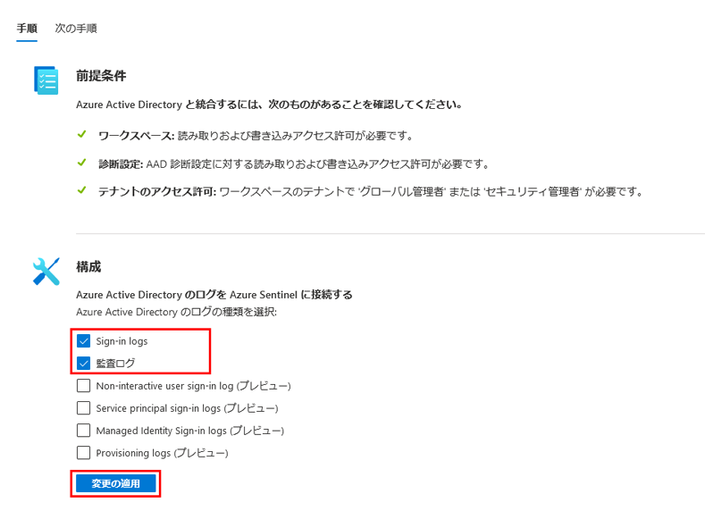

---
lab:
    title: '31 - Azure Active Directory (Azure AD) から Microsoft Sentinel へデータを接続する'
    learning path: '04'
    module: 'モジュール 04 - Azure Active Directory の監視と保守を行う'
---

**注 - このラボは、2 月 4 日に SC-300 ラボから廃止されます。  近い将来、Microsoft Sentinel をカバーするためのより興味深いラボを紹介する予定です。  SC-300 クラスを教えている場合は、オプションでこのラボを含めるか除外するかを選択できます。  使用する場合は、Azure Pass とサブスクリプションを設定する必要があります。**

# ラボ 31: Azure Active Directory (Azure AD) から Microsoft Sentinel へデータを接続する

## ラボ シナリオ

あなたの会社では、セキュリティ情報イベント管理 (SIEM) ソリューションの使用を開始する予定です。Microsoft Sentinel にアクセスできることはわかっているので、それを Azure AD に接続することに慣れる必要があります。

#### 推定時間: 10 分

## 前提条件

- 任意の Azure AD ライセンス (Free、O365、P1、P2) があれば、Microsoft Sentinel にサイン-イン ログを取り込むことができます。Azure Monitor (Log Analytics) と Azure Sentinel には、追加のギガバイト単位の料金が適用される場合があります。

- ユーザーには、ワークスペースの Microsoft Sentinel 共同作成者ロールを割り当てる必要があります。

- ユーザーには、ログをストリーミングするテナントの全体管理者またはセキュリティ管理者のロールを割り当てる必要があります。

- 接続の状態を確認できるように、ユーザーは Azure AD 診断設定に対する読み取りおよび書き込みアクセス許可を持っている必要があります。

## Microsoft Sentinel ワークスペースを作成および追加する

Microsoft Sentinel で使用できるワークスペースがまだない場合は、これらの手順を使用します。

1. グローバル管理者アカウントを使用して、[https://portal.azure.com](https://portal.azure.com) にサインインします。

2. 「**Microsoft Sentinel**」を検索して選択します。

3. 「Microsoft Sentinel ワークスペース」ブレードのメニューで、「**+ 作成**」を選択します。

4. Microsoft Sentinel ワークスペースが既にある場合は、それを選択して次のタスクに進むことができます。

5. 「Microsoft Sentinel をワークスペースに追加する」ブレードで、「**新しいワークスペースの作成**」を選択します。

6. 次の情報を使用して、新しい Log Analytics ワークスペースを作成します。

    | 設定| 価値|
    | :--- | :--- |
    | サブスクリプション| 現在のサブスクリプションを使用します。|
    | リソース グループ| 既存のリソース グループを使用するか、新しいリソース グループを作成します。|
    | 名前| **Lab-workspace-yourinitialsanddate** ワークスペースはグローバルに一意の値である必要があります。|
    | 価格レベル| 従量課金制 (Per GB 2018) |

7. 「**Review + create**」を選択します。
8. **検証に成功**のメッセージが表示されたら、「**作成**」を選択します。

9. 完了したら、新しいワークスペースを選び、「**追加**」を選択して Microsoft Sentinel にワークスペースを追加します。

## Azure Active Directory に接続する

Microsoft Sentinel の組み込みコネクタを使用して、[https://docs.microsoft.com/ja-jp/azure/active-directory/fundamentals/active-directory-whatis](https://docs.microsoft.com/ja-jp/azure/active-directory/fundamentals/active-directory-whatis) からデータを収集し、それを Microsoft Sentinel にストリーミングできます。コネクタを使用すると、[https://docs.microsoft.com/ja-jp/azure/active-directory/reports-monitoring/concept-sign-ins](https://docs.microsoft.com/ja-jp/azure/active-directory/reports-monitoring/concept-sign-ins) と [https://docs.microsoft.com/ja-jp/azure/active-directory/reports-monitoring/concept-audit-logs](https://docs.microsoft.com/ja-jp/azure/active-directory/reports-monitoring/concept-audit-logs) からストリーミングできます。

1. Microsoft Sentinel で、左側のナビゲーション メニューの「**構成**」の下にある「**データ コネクタ**」を選択します。

2. 「**データ コネクタ**」リストで、**Azure Active Directory** を選んでから、「**コネクタ ページを開く**」を選択します。

    

3. 「**構成**」で、「**Azure Active Directory のサインイン ログ**」と「**監査ログ**」のチェック ボックスをオンにしてから、「**変更の適用**」を選択します。

    

4. Azure Active Directory コネクタ ページを閉じます。
